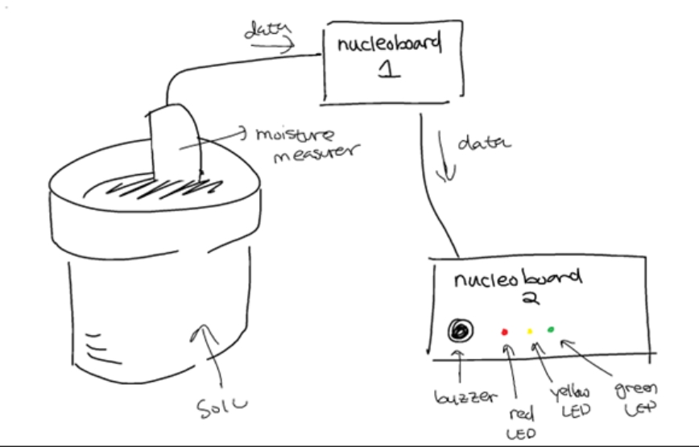
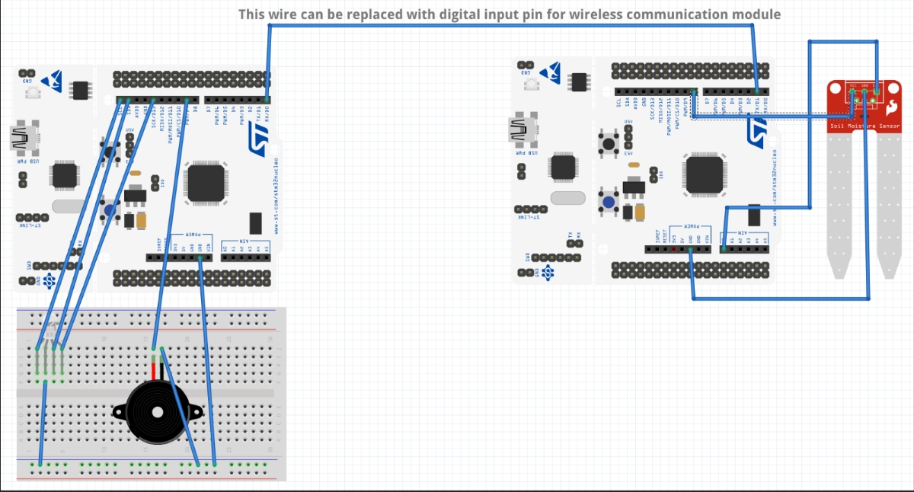
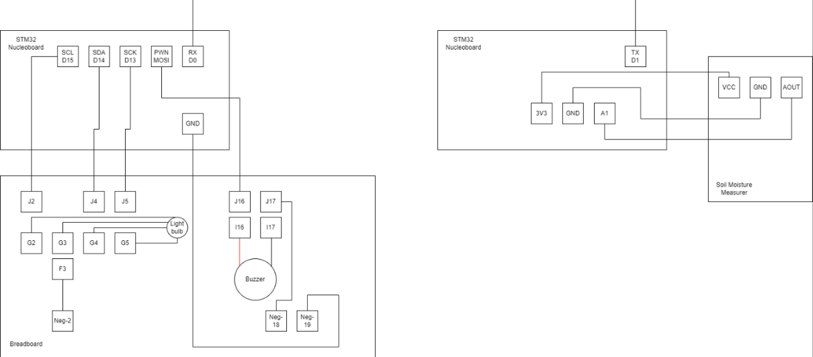
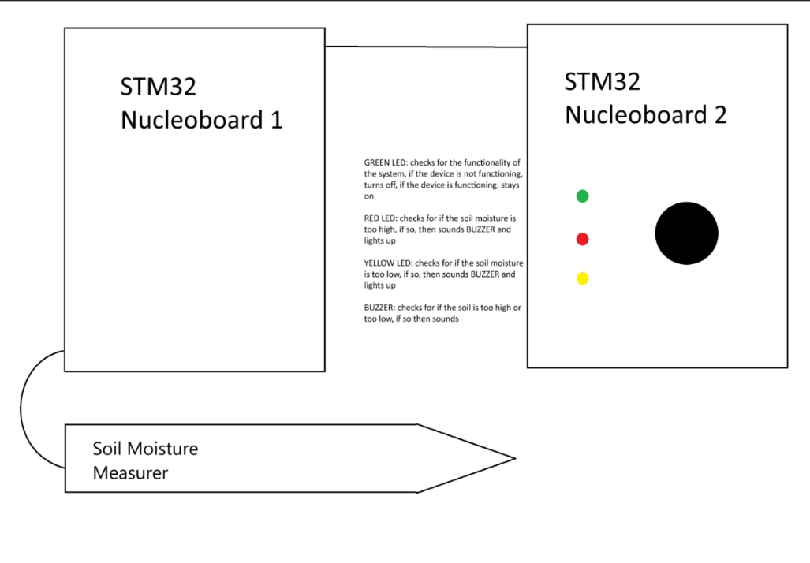

# ECE-198-Soil-Humidity-Project

## Navigating This Repo

You will find everything you need in the base directory of this repo. Please read over the design document carefully and download the raw program file to copy & paste into the CubeIDE, the instructions for installing which is included in the design document. However, if you would like to dig a bit deeper, you can find launch info in the core folder, and older versions of our design in the archive folder.

## Installation Manual 

1. Carefully place the soil moisture measurer in the soil and place the microcontroller-container 1 on the ground near it. 

2. Plug USB-2 cable of the STM32 into a power source of less than 5V. 

3. Check all the wiring to make sure it is secure, including wiring on the soil moisture measurer, breadboard, STM32 Nucleoboard. 

4. Test the soil moisture measurer in water to ensure that it is functioning properly. The value of soil moisture of water should be around 95%-100%. 

5. Test the LED and buzzer connection by repeating step 5 in air instead of water. Since the humidity of the air is low, the buzzer should sound, and the yellow LED should light up. 

6. Test the soil moisture measurer using dry soil. The LED should glow yellow, and the buzzer should sound. 

7. If at any point the red LED turns on, then repeat steps 3-7 after reconnecting the USB-2 cable and wiring on the breadboard.

## User Manual

1. Place the soil moisture measurer in the soil and the receiving module at a location of your convenience. Dispose of any waste properly.
2. If the RED light and BUZZER on the receiving module turn on, then the soil moisture level is lower than recommended. Consider watering the soil.
3. If the YELLOW light and BUZZER turn on, then there is an issue with the device. Consult troubleshooting.
4. If the GREEN light turns on, then the soil moisture level is higher than recommended, and no action needs to be taken.

## Troubleshooting

- Check the wire connections from the STM32 Nucleoboard as well as the soil moisture sensor to see if they are still connected securely.
- If the issue persists, consider replacing the cables. New cables can be purchased online or at electronic component shops. It is advised that cables are replaced regularly, or at least once every year.
- If the issue persists, consider replacing the sensor, especially if it had been exposed to water and dust for long periods of time. 

## Diagrams

